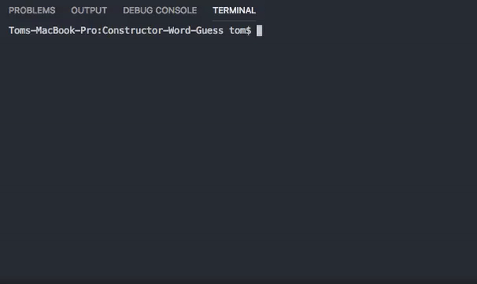
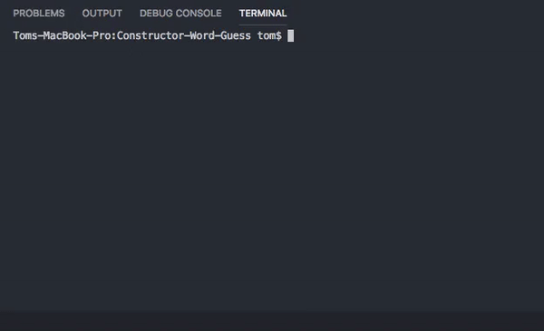

# Constructor-Word-Guess

## What is the App?

Constructor-Word-Guess is a simple hangman like CLI game that uses multpile contructor functions over multpile js files to handle functions. The purpose of the app is to show the usefulness of splitting up functions between files to make for much cleaner and esier to understand code. Creating more complex js applications can be made much easier to manage using the methods from this app.

## How it Works

Thes app is meant to be used with node from command line. The CLI utilizes inquirer.js (https://www.npmjs.com/package/inquirer) and random-words (https://www.npmjs.com/package/random-words) package managers. After initally exicuting index.js a random word will be selected using random-words and the user will be prompt to enter random letters using an inquirer function that is called recursively until the word is guessed or a certain incorrect guess limit is reached. (See gif examples of winning and losing below).

### Gif Examples

### How the Code Works

NPM packages and user input is managed in index.js with the actual JS functions being called in index.js from word.js and letter.js as modules using the require function. 

#### 1. Index.js

Index.js handles user input, inquirer, and radom-words packe managers. It first takes a single random word from random-words and creates a fill-in-the-blanks array used to represent blank letter for the user to guess. It then calls an inquirer function called guess() that takes user input and tests if it's a single character to be taken as a guess and if so passes it, the word, and blank word array into word.js. guess() is then called recursively to run again after input is tested and displayed in the other JS files. Process.exit(0) is used to exit node once the game is won or lost in letter.js or word.js.

#### 2. Word.js

Word.js keeps track of guesses remaining, and uses a constructor function to take arguments from index.js and call functions from letter.js to test if a guess is correct and display results. First it takes a guess, the word to be guessed and fill-in-the-blanks array and passes them into a function from letter.js (letter.incorrect) tests whether a letter is included in the word to be guessed and if not places them in an array. The function does NOT do anything else, its purpose is to return an updated array of incomplete guesses and if an incorrect letter is guessed twice return undefined which stops the next letter.js function from being called. This is to prevent the user from losing more than one guess to the same worng letter if guessed twice or more. The second function called from letter.js tests the guess if correct and returns the filled blnak array either unchanged or filled where the letter is positioned in the word.

#### 3. Letter.js

Letter.js contains a global variable to letter.js keeping track of guesses remaining and a constructor containing 2 functions called in word.js. 

1. The first, this.incorrect(letter.incorrect in word.js) tests whether a letter NOT in the word has been guessed and if not pushes the letter into an array named incorrectGuesses (starts as empty) and returns the array. If that letter is guessed again the function prompts the user to guess again and returns an undefined value so word.js does not call the next function in letter.js. 

2. The second function, this.test (letter.test in word.js), takes the current letter guessed, the word, and fill-in-the0blanks array and tests if the letter is correct or incorrect. If correct it fills the corresponding blank array with letter(s) and displays guesses remaining. If the letter is not in the word it takes decrements the remaining guesses and if no guesses remaing exits the code after displaying the correct answer. Because the second function won't be called after the first function if a letter is repeted hte user cannot lose two guesses to the same incorrect letter. The winning state is handled in word.js